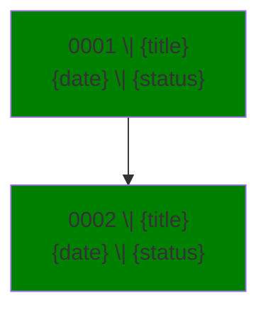
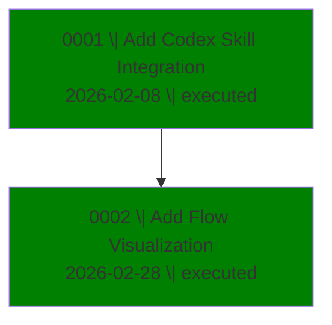

# AgDR Flow Visualization

Generate a Mermaid flowchart and markdown table showing all AgDR decisions in the current project.

## When to Use

Use when user wants to see an overview of all decisions:
- "Show me the AgDR history"
- "What decisions have been made?"
- "Visualize all AgDRs"
- "Overview of technical decisions"

## Path Anchoring Rules

Always anchor all file operations to the active project directory (`cwd`) for the current task.

- First, read `pwd` and treat it as the project root.
- Resolve `docs/agdr/` as `${cwd}/docs/agdr/`.
- Do not probe `/`, `/Users`, `$HOME`, or parent directories when `docs/agdr/` is missing.
- If `${cwd}/docs/agdr/` does not exist, report that exact path and stop.

## Output Destination

Write the generated markdown to: `${cwd}/docs/agdr/flow.md`

Also display the content in chat so user can see it immediately.

---

## Step-by-Step Instructions

### Step 1: Discover AgDR Files

Find all AgDR markdown files under the current project root:
- Directory: `${cwd}/docs/agdr/`
- Pattern: `AgDR-*.md`
- Sort by ID number (ascending)

**Edge case:** If no files found, generate a placeholder output saying `No AgDR files found in ${cwd}/docs/agdr/` and stop.

### Step 2: Parse Each AgDR

For each file, extract these fields:

**From Frontmatter (YAML between `---`):**
| Field | Required | Fallback |
|-------|----------|----------|
| `id` | Yes | Derive from filename: `AgDR-XXXX` |
| `status` | Yes | `unknown` |
| `timestamp` | No | Empty |
| `agent` | No | `unknown` |
| `supersedes` | No | Empty |

**From Body:**
- **Title**: First `# Heading` line (remove the `# `)
- **References**: Any markdown link matching `[...](...AgDR-XXXX...)`

### Step 3: Extract Date

Parse `timestamp` to `YYYY-MM-DD` format. If parsing fails or field is empty, leave blank.

### Step 4: Build Relationships

**Chronological edges** (solid line `-->`):
- Sort AgDRs by ID
- Connect sequential: 0001 → 0002 → 0003

**Superseded edges** (dashed line `-.->`):
- If `supersedes: AgDR-XXXX` exists, add: XXXX → current

**Reference edges** (double arrow `==>`):
- For each link to another AgDR, add: current → referenced

**Skip self-loops:** Don't create edges where source equals target.

### Step 4.5: Build Cluster Summary (No Emojis)

Build clusters dynamically so the output works for any repository.

Use this deterministic process:

1. Generate per-AgDR topic tokens from the title and first two body headings:
   - Lowercase
   - Remove punctuation
   - Remove stopwords (for example: and, or, the, to, of, for, with, in, on, by, via, add, update, improve)
   - Remove tokens shorter than 3 chars
2. For each AgDR, keep the top 2 meaningful tokens as its topic signature.
3. Group AgDRs into clusters by signature overlap:
   - Same primary token => same cluster
   - If primary tokens differ but share at least one signature token, merge clusters
4. Create cluster names from dominant tokens in each group (Title Case, no emojis), e.g. `Database Schema`, `CLI Testing`, `API Contracts`.
5. If a group has only one AgDR and no meaningful overlap with others, place it in `Miscellaneous`.

Build a markdown table with:
- Cluster name
- Comma-separated AgDR IDs (ascending)
- Theme text (one short phrase summarizing common intent of that cluster, inferred from shared tokens/titles)

### Step 5: Generate Output

Create markdown with four sections:

1. **Summary** - Statistics
2. **Table** - Quick scan of all decisions
3. **Cluster Summary** - Decisions grouped by cluster (no emojis)
4. **Mermaid** - Visual diagram

---

## Status Colors

| Status | Color |
|--------|-------|
| executed | green |
| proposed | orange |
| superseded | gray |
| unknown | gray |

Apply with: `style 0001 fill:green`

---

## Output Template

```markdown
## AgDR Summary
- **Total**: {count} decisions
- **By Status**: Executed: {n} | Proposed: {n} | Superseded: {n}
- **By Agent**: {agent}: {n} | {agent}: {n}

## AgDR Table

| ID | Title | Status | Agent | Date |
|---|---|---|---|---|
| 0001 | {title} | {status} | {agent} | {date} |

## Cluster Summary

| Cluster | AgDRs | Theme |
|---|---|---|
| Database Schema | 0001, 0004, 0006 | Data model and storage architecture |
| CLI Testing | 0002, 0003 | Command interface and validation behavior |
| Miscellaneous | 0005 | Decision does not strongly cluster with others |

## AgDR Flow



**Legend:**
- `-->` chronological
- `-.->` superseded by
- `==>` references
```

---

## Example Output

```markdown
## AgDR Summary
- **Total**: 2 decisions
- **By Status**: Executed: 2 | Proposed: 0 | Superseded: 0
- **By Agent**: codex: 2

## AgDR Table

| ID | Title | Status | Agent | Date |
|---|---|---|---|---|
| 0001 | Add Codex Skill Integration | executed | codex | 2026-02-08 |
| 0002 | Add Flow Visualization | executed | codex | 2026-02-28 |

## Cluster Summary

| Cluster | AgDRs | Theme |
|---|---|---|
| Platform Tooling | 0001, 0002 | Tooling and workflow decisions |

## AgDR Flow



**Legend:**
- `-->` chronological
- `-.->` superseded by
- `==>` references
```

---

## Troubleshooting

| Issue | Solution |
|-------|----------|
| No files found | Check `${cwd}/docs/agdr/` exists with `AgDR-*.md` files |
| Missing `id` field | Derive from filename (e.g., `AgDR-0001-slug.md` → `AgDR-0001`) |
| Missing title | Use filename without extension |
| Missing status | Use `unknown` |
| Date parse fails | Leave date field empty |
| Self-loop edge | Skip it (don't create edge where source = target) |
| Weak clustering quality | Fall back to broader names and include `Miscellaneous` |
