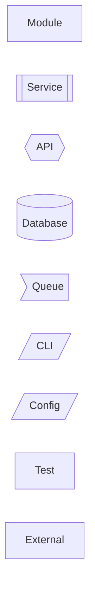
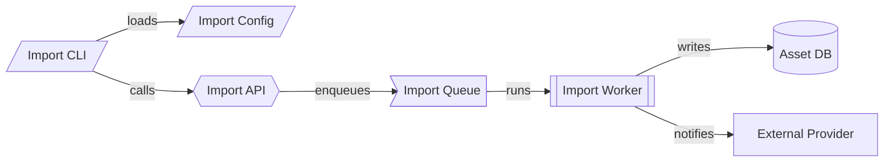

Generate a concise PR review story as a markdown file:

`docs/reviews/{branch_name}_{date}_{latest_commit}.md`

The goal is to help a reviewer understand the PR in 1-2 minutes. Prefer a clear narrative over a line-by-line review. Focus on the reviewer's fastest path to understanding what changed, where to look, and what risk or behavior changed.

# Output Structure

## 1. Summary

Write 2-4 sentences covering:

- What changed
- Which area of the codebase was affected
- What the reviewer should understand before reviewing the diff

Avoid PR statistics such as files changed, lines added, or lines removed.

## 2. Key Changes

List 3-5 key changes maximum.

For each change, include:

- **What changed:** one concise sentence
- **Impact:** one concise sentence explaining how behavior, structure, or maintainability changed
- **Main files:** 1-4 important files only
- **Snippet:** include a small code snippet only when it clarifies a non-obvious implementation detail

Use snippets sparingly. Prefer 5-15 lines. Do not paste large blocks.

## 3. Review Map

Add a Mermaid graph when it helps explain control flow, data flow, ownership boundaries, dependencies, or before/after structure.

Choose the graph type based on the PR:

- Use `flowchart` for execution paths, request flows, pipelines, or user journeys.
- Use `sequenceDiagram` for interactions between services, clients, jobs, or APIs.
- Use `classDiagram` only for meaningful type or ownership relationships.
- Use `stateDiagram-v2` for lifecycle, status, or transition changes.
- Skip the graph if it would repeat the written summary without adding clarity.

## 4. Reviewer Focus

Add 2-4 bullets that guide the reviewer toward the highest-value review areas.

Use this section to call out:

- Behavior that changed
- Interfaces or contracts that changed
- Risky assumptions
- Compatibility or migration concerns
- Places where a reviewer should start

Do not add a generic checklist.

# Mermaid Graph Standards

All graphs must be readable in a PR markdown view and useful at a glance.

## Graph Content

- Show only the components directly affected by the PR and the minimum context needed to understand them.
- Use short node labels, usually 1-4 words.
- Prefer verbs for edges, such as `validates`, `publishes`, `hydrates`, `routes`, or `persists`.
- Avoid implementation noise such as helper functions, private methods, or obvious framework calls.
- Keep graphs to 5-9 nodes when possible.
- If the graph needs more than 12 nodes, group nodes into subgraphs or simplify it.
- Make changed PR components visually distinguishable from unchanged context.

## Color Model

Use two layers of visual meaning:

1. **Item type**: color and shape communicate what the node is.
2. **Change state**: border style communicates how the PR affects the node.

Do not use arbitrary colors. Use the standard classes below.

## Item-Type Classes

Use these Mermaid classes for node types:

```mermaid
flowchart LR
  classDef module fill:#E8F1FF,stroke:#1565C0,color:#0D376D
  classDef service fill:#E6F4EA,stroke:#2E7D32,color:#0B3D16
  classDef api fill:#EDE7F6,stroke:#6A1B9A,color:#311B5F
  classDef db fill:#FFF4D6,stroke:#B26A00,color:#5A3600
  classDef queue fill:#FFF0E6,stroke:#D84315,color:#6A1B00
  classDef cli fill:#E0F7FA,stroke:#00838F,color:#004D55
  classDef config fill:#F1F8E9,stroke:#558B2F,color:#2D4A16
  classDef test fill:#F5F5F5,stroke:#616161,color:#333333
  classDef external fill:#ECEFF1,stroke:#546E7A,color:#263238
  classDef removed fill:#FAFAFA,stroke:#757575,color:#424242,stroke-dasharray: 5 5
```

Apply item-type classes consistently:

- `module`: internal module, package, class, library, or reusable code unit
- `service`: internal runtime service, worker, scheduler, or background job
- `api`: route, endpoint, controller, resolver, webhook, or public interface
- `db`: database, table, index, model store, cache, or persistent storage
- `queue`: queue, topic, stream, event bus, pub/sub channel, or async handoff
- `cli`: command-line entry point, script, management command, or developer tool
- `config`: settings, environment variables, feature flags, manifests, policy files, or deployment config
- `test`: test suite, fixture, mock, snapshot, or validation harness
- `external`: dependency outside the PR boundary, such as third-party API, cloud provider, external service, or unchanged upstream/downstream system
- `removed`: deleted, deprecated, bypassed, or replaced component

## Recommended Node Shapes

Use shape as a secondary cue when it improves readability:



Recommended mapping:

- Modules: `M[Module]`
- Services or workers: `S[[Service]]`
- APIs or contracts: `A{{API}}`
- Databases or persistent stores: `D[(Database)]`
- Queues or streams: `Q>Queue]`
- CLI commands: `C[/CLI/]`
- Config files or flags: `F[/Config/]`
- Tests: `T[Test]`
- External systems: `X[External]`

Use shapes only when they remain readable in markdown. If the graph becomes visually busy, keep simple rectangular nodes and rely on classes.

## Change-State Classes

Use change-state classes as border styles on top of item-type color classes when needed:

```mermaid
flowchart LR
  classDef changed stroke-width:3px
  classDef newNode stroke-width:3px,stroke-dasharray: 0
  classDef risky stroke:#C62828,stroke-width:4px
  classDef deprecated stroke-dasharray: 5 5
```

Apply change-state classes sparingly:

- `changed`: existing component modified by the PR
- `newNode`: new component introduced by the PR
- `risky`: contract, migration, side effect, security, performance, or compatibility-sensitive area
- `deprecated`: path retained temporarily, bypassed, or marked for removal

When Mermaid rendering does not combine multiple classes reliably in the target markdown viewer, prefer item-type classes first and call out risk in the `Reviewer Focus` section.

## Graph Example



# Writing Rules

- Be concise and reviewer-oriented.
- Prefer concrete nouns and verbs.
- Avoid filler phrases and broad claims.
- Do not explain obvious code.
- Do not include PR size statistics.
- Do not add a dedicated `Testing` or `Documentation` section unless those changes are central to the PR.
- Do not add a separate `Why` section unless the user asks for it.
- Include rationale inline only when it helps the reviewer understand a non-obvious tradeoff.
- Mention uncertainty explicitly if the diff does not provide enough context.

# Code Snippet Rules

Include snippets only for:

- New or changed public interfaces
- Non-obvious branching logic
- Important data transformation
- Changed error handling
- Changed persistence or side-effect behavior
- A risky assumption reviewers should inspect

Avoid snippets for:

- Imports
- Mechanical renames
- Boilerplate
- Formatting-only changes
- Repeated patterns already explained once

Each snippet must include a file path heading.

Example:

````markdown
`src/api/orders.py`

```python
result = order_service.create_order(
    account_id=account_id,
    items=items,
    source="checkout",
)
```
````

# Reviewer Usefulness Heuristics

Apply these review-support concepts while keeping output short:

- **Cognitive load reduction:** group related changes by behavior, not by file order.
- **Review path guidance:** tell reviewers where to start when one file anchors the change.
- **Risk-first framing:** surface contract changes, side effects, migrations, and failure modes.
- **Boundary clarity:** distinguish code changed in the PR from external systems or unchanged dependencies.
- **Signal over coverage:** omit details that do not change reviewer understanding.

# Final Check

Before writing the file, verify:

- The story can be read in 1-2 minutes.
- The graph uses the standard Mermaid item-type classes.
- Change-state styling is used only where it adds reviewer value.
- The key changes are limited to the most important 3-5 items.
- Every snippet earns its place.
- The reviewer knows where to focus first.
